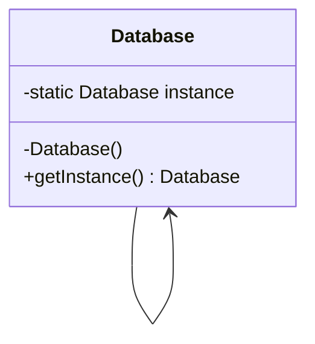

Creational design patterns provide various object creation mechanisms, which increase flexibility and reuse of existing code.
# Singleton Design Pattern
This pattern ensures that there is only a single instance of the class object in the Java Virtual Machine. There is a global point of access to that single instance
- The default constructor is made private to prevent new instances being created.
- A static creation method is introduced that uses the constructor behind the scenes to return the object instance and save it in a static field. Once the object is instantiated, the same static instance is used every time.

## Method 1: Lazy Instantiation
```java
class Database {
	private static Database instance;
	// private constructor to force use of
	// getInstance() to create Singleton object
	private Database() {}
	public static Database getInstance() {
	  if (instance==null)
	  instance = new Database();
	  return instance;
	}
}
```
## Method 2: Putting the Instance creation code in Critical section to prevent multiple threads simultaneously instantiating instance
```java
// Thread Synchronized Java implementation
class Database {
    private static Database instance;
    private Database() {}
    // Only one thread can execute this at a time
    public static synchronized Database getInstance() {
        if (instance==null)
            instance = new Singleton();
        return instance;
    }
}
```
**Disadvantage**: Every thread has to wait at the synchronised code block whether or not the object has been instantiated which reduces time efficiency.
## Method 3: Eager Instantiation
```java
// Static initializer based Java implementation
class Database {
	// A new instance is created immediately, every time
    private static Database instance = new Database();
    private Database() {}
    public static Database getInstance() {
        return instance;
    }
}
```
## Method 4: Double Check Locking
```java
// Double Checked Locking based Java implementation of
// singleton design pattern
class Database {
//Object is marked volatile - this means that each thread should always get the value of this instance from main memory
    private static volatile Database instance  = null;
    private Database() {}
    public static Database getInstance() {
    //If the instance is already set the thread does not need to wait in the synchronised section and can return from the function.
        if (instance == null) {
	        //Only one thread can enter below section at a time
            synchronized (Database.class) {
                if (instance==null)
                    instance = new Database();
            }
        }
        return instance;
    }
}
```
 
| Pros | Cons |
| --- | --- |
| You can be sure that a class has only a **single instance**. | **Violates the Single Responsibility Principle**. The pattern solves two problems at the time. |
| You gain a **global access point** to that instance. | The Singleton pattern **can mask bad design**, for instance, when the components of the program know too much about each other.|
| The singleton object is **initialized only** when it’s requested **for the first time**. | The pattern **requires special treatment in a multithreaded environment** so that multiple threads won’t create a singleton object several times. |
| | It may be **difficult to unit test** the client code of the Singleton because many test frameworks rely on inheritance when producing mock objects.|

# Factory Design Pattern
- A class which is responsible for the creation of objects of a particular type of class.
- Loosens coupling by separating the construction code from code that uses the product.
- Relies heavily on inheritance
- The object being created is represented by an interface which is implemented by concrete products and the creator is represented by an abstract class which is extended by concrete factories.
- easy extension, vague objects known, can introduce new products.
- It violate open-close principle, because more if conditions have to be added to allow creation of new types (thus requiring modification of the class).
## Abstract Factory
- allow producing families of related objects without specifying concrete classes (unlike simple factory where an if condition is required to choose the factory).
- follows open-close and single responsibility principle
# Builder Design Pattern
- Extract object construction out of class and into seperate builder classes (build method inside the builder class).
- The constructor of the class being built should not be public so that only the build method of builder class can access it.
- Thus the object is built only with those parameters that are passed to the builder class
- Separates construction and representation
- Addition of setter methods for building
- May require creating builder and director
## Director
Defines the order in which construction steps are called to reuse some construction routines (a subset of common attributes always instantiated perhaps)
# Prototype Design Pattern
- Copying of an object to another of same class is tightly coupled because it is dependent on whether certain object attributes are public or not.
- Delegates object duplication process to actual objects and not coupling to its class.
- One prototype interface with only one clone method. The eventual objects inherit this through their parent. The parent is the concrete prototype which implements the prototype interface. The clone method that is eventually implemented in the the child uses copy constructor to return object in clone method
- A similar structure can be used to define a clone method to copy a list of such objects.
- If instances of objects are being copied without instantiating new ones a shallow copy may take place. For deep copies, a new object with the same attribute values should be created.
- Doesnt depend on concrete classes, gets rid of duplicate code.
## Prototype Registry
It is a catalog of frequently used prototypes