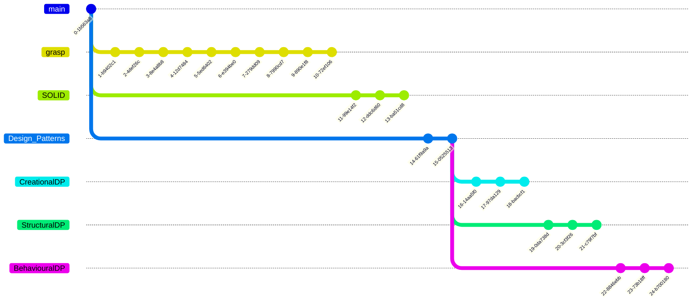

# Object Oriented Design
This repository contains some notes on popular Object oriented design principles and patterns. Inspect the branches for more information...

```mermaid
gitGraph
commit
branch grasp
checkout grasp
commit
commit
commit
commit
commit
commit
commit
commit
commit
commit
checkout main
branch SOLID
checkout SOLID
commit
commit
commit
checkout main
branch Design_Patterns
checkout Design_Patterns
commit
commit
branch CreationalDP
checkout CreationalDP
commit
commit
commit
checkout Design_Patterns
branch StructuralDP
checkout StructuralDP
commit
commit
commit
checkout Design_Patterns
branch BehaviouralDP
checkout BehaviouralDP
commit
commit
commit
checkout main
```
