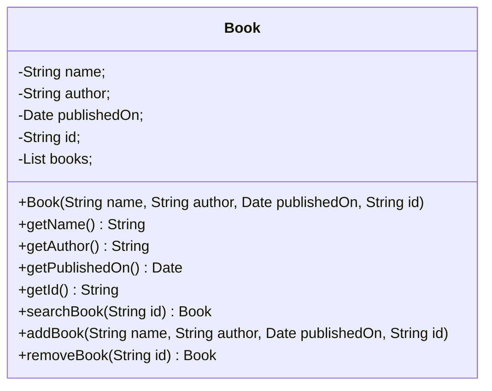
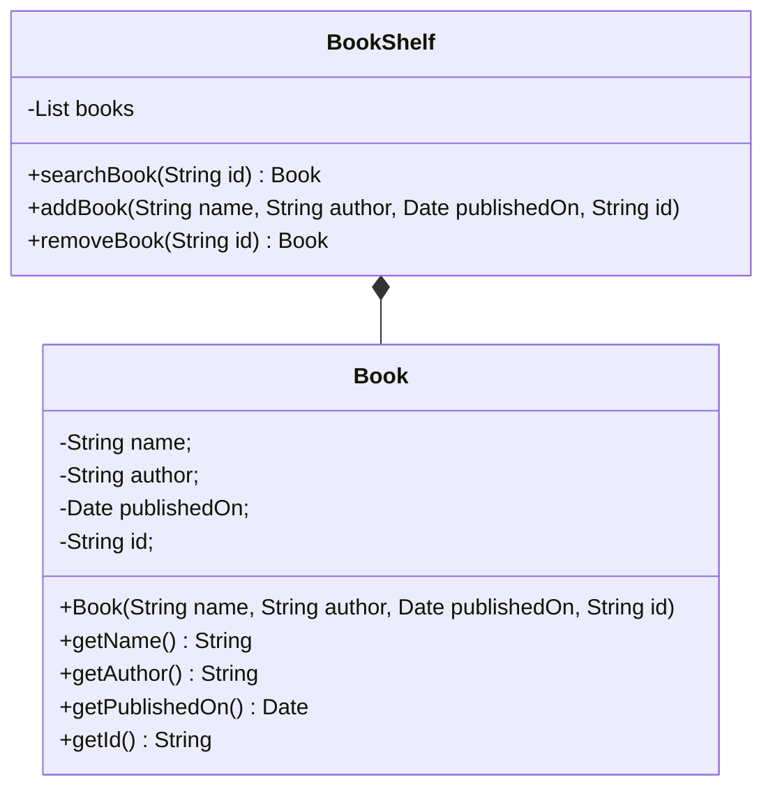
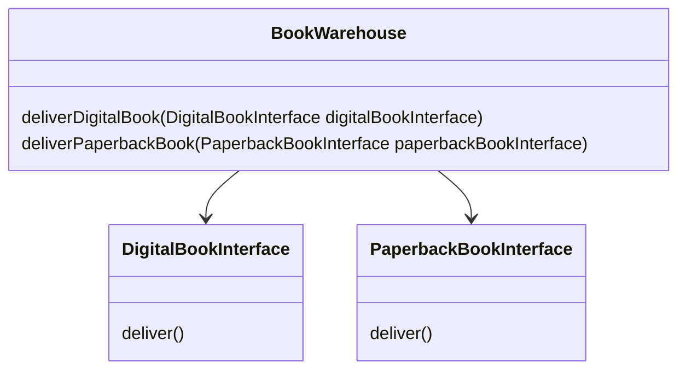
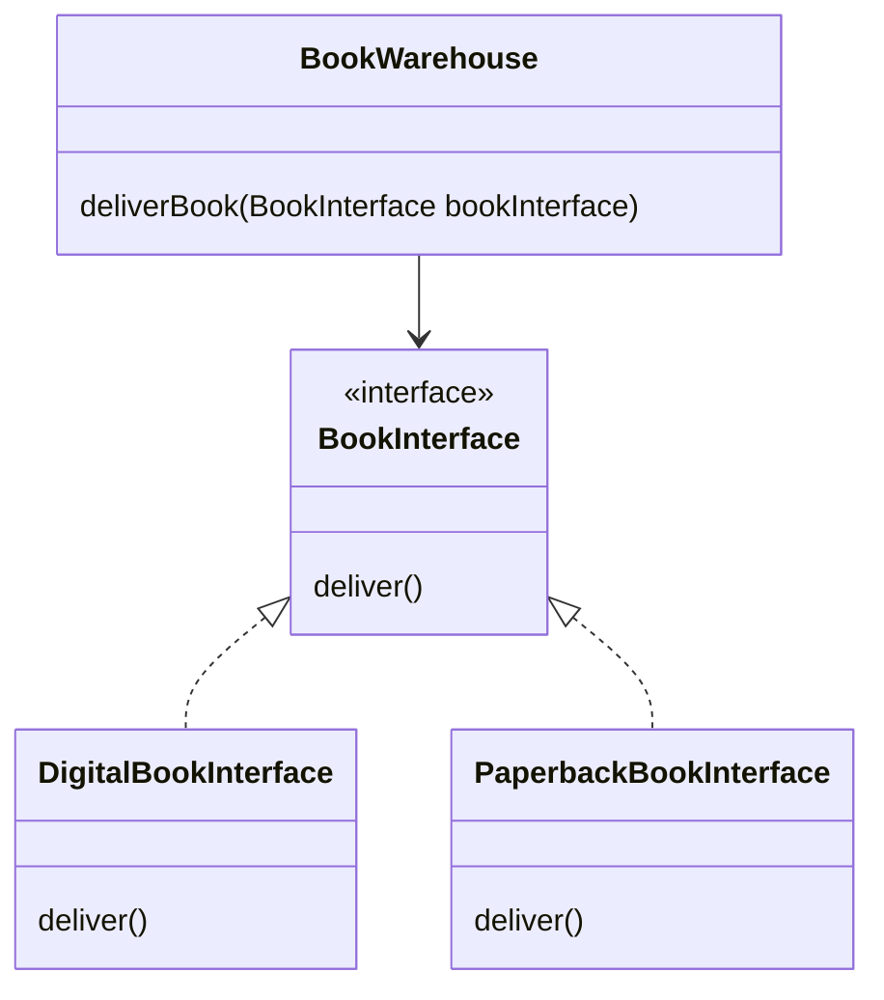
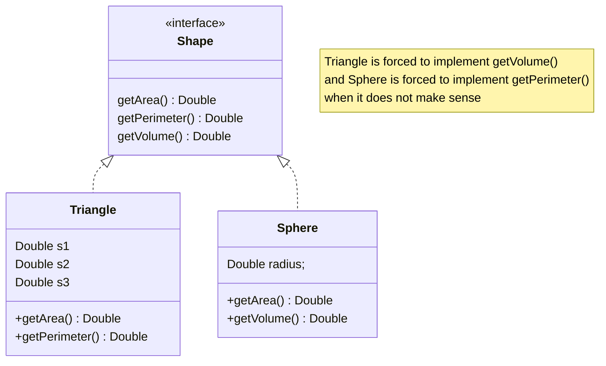
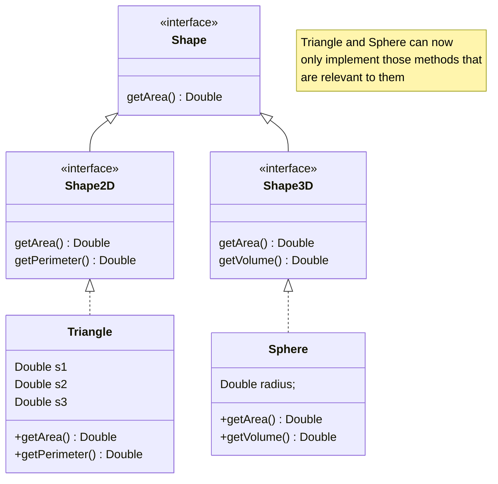
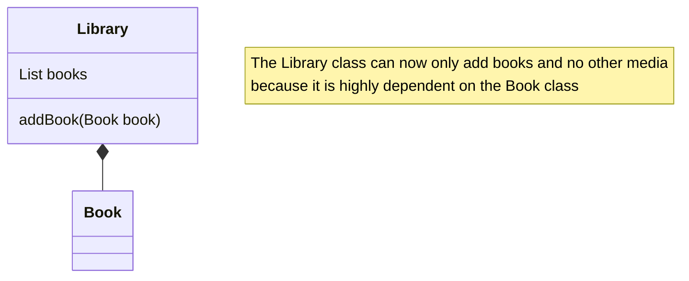
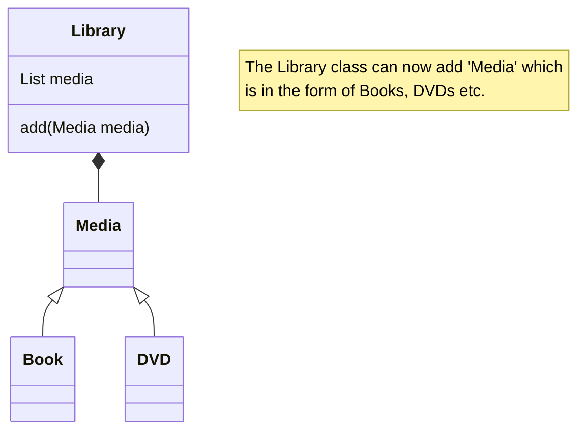

SOLID is an acronym for 5 design principles that leads to flexible and stable software thats easier to maintain and extend and less likely to break.
They help in reducing dependencies and achieving low coupling and high cohesion.
# SOLID Design Principles
## Single Responsibility Principle
**Every module should have responsibility over a single feature of the system**
```java
public class Book {  
    //First responsibility of Book : Set values of Book objects  
    private String name;  
    private String author;  
    private Date publishedOn;  
    private String id;  
    private List<Book> books;  
    public Book(String name, String author, Date publishedOn, String id) {...}  
    public String getName() {...}  
    public String getAuthor() {...}  
    public Date getPublishedOn() {...}  
    public String getId() {...}  
    //Second Responsibility of Book : modifying collection of books (incorrect)  
    public Book searchBook(String id) {...}  
    public void addBook(String name, String author, Date publishedOn, String id) {...}  
    public Book removeBook(String id) {...}  
}
```

```java
public class Book {  
    //First responsibility of Book : Set values of Book objects  
    private String name;  
    private String author;  
    private Date publishedOn;  
    private String id;  
    public Book(String name, String author, Date publishedOn, String id) {...}  
    public String getName() {...}  
    public String getAuthor() {...}  
    public Date getPublishedOn() {...}  
    public String getId() {...}  
}

//The second responsibility is put in a different class
public class BookShelf {  
    private List<Book> books = new ArrayList<>();  
    public Book searchBook(String id) {...}  
    public void addBook(String name, String author, Date publishedOn, String id) {...}  
    public Book removeBook(String id) {...}  
}
```

### Advantages
- The number of test cases decreases
- Lower coupling due to fewer dependencies
- Smaller classes are easier to search than bigger monolithic ones


## Open Closed Principle
It states that classes, modules, microservices, and other code units should be **open for extension but closed for modification**.
We should be able to extend the existing code using OOP features like inheritance via subclasses and interfaces.
While adding  a new feature extend the code rather than modifying it, so that the risk of failure is minimised.





## Liskov Substitution Principle
An object of a superclass should be replaceable by objects of its subclasses without causing issues in the application. 
- A child class should never change the characteristics of its parent class
- Derived classes should never do less than their base class
## Interface Segregation Principle
A class should not be forced to implement interfaces that it does not need to. To allow this interfaces should be split into smaller ones.



## Dependency Inversion Principle
High level modules should not depend on low level modules, both should depend upon abstractions.
Dependency Inversion Principle is a specific combination of the Open-Closed and Liskov Substitution Principles.
This principle helps in separating the presentation layer, business layer and data access layer of the software.





