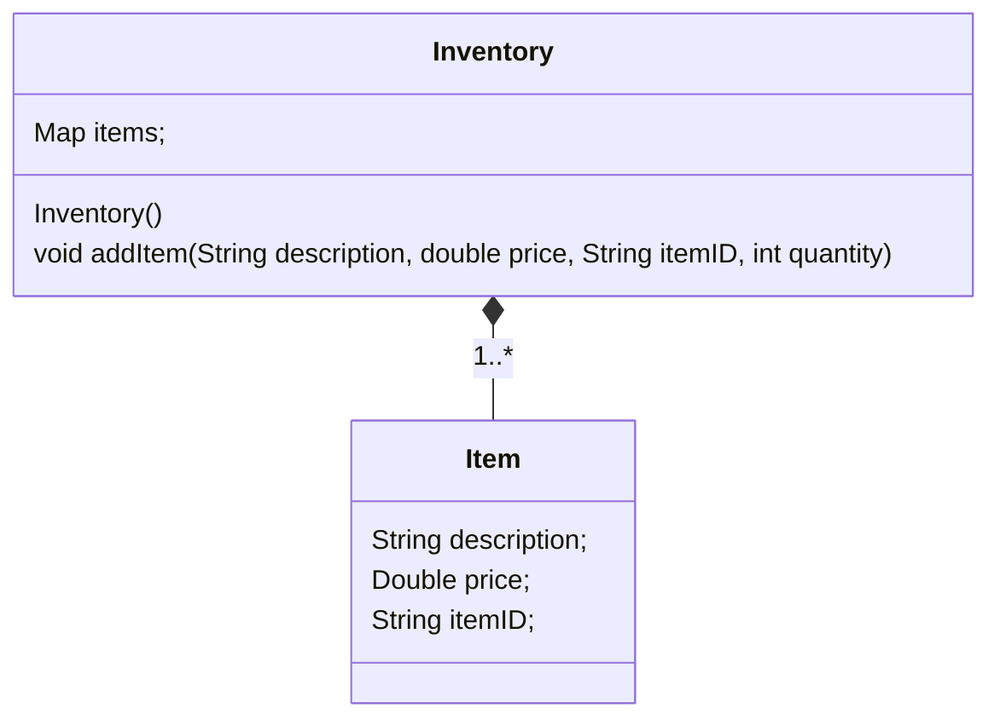
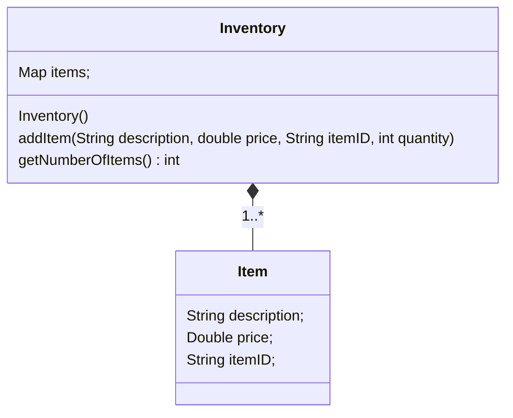
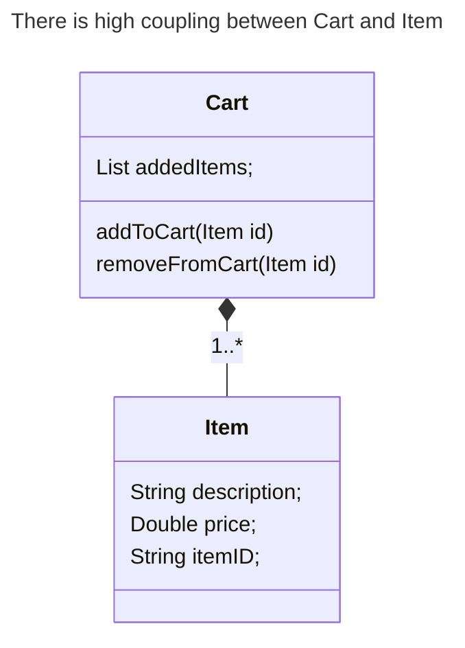
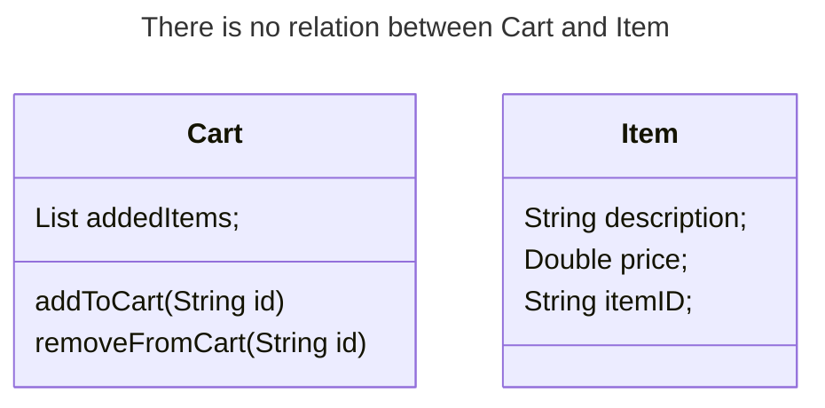
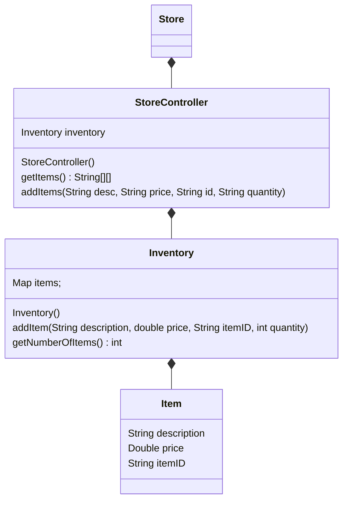
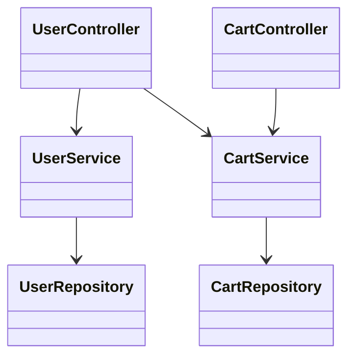
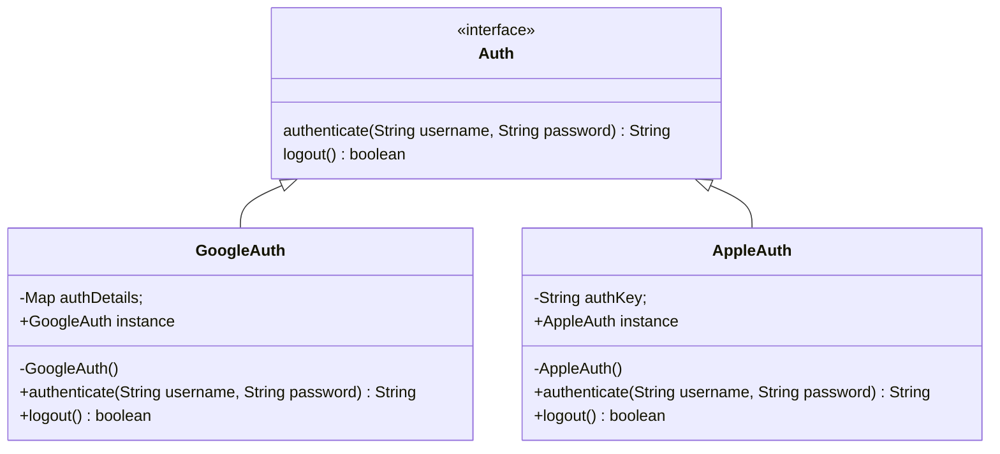

Stands for *General Responsibility Assignment Software Pattern*
As a tool for software developers, provides a means to solve organisational problems and offers a common way to speak about abstract concepts.
GRASP achieves *Responsibility Driven Design*.
UML gives the contract or obligation of classifier
# Responsibility
It is a contract or obligation that a class or object must accomplish.
# Types of Responsibility
1. Doing: Initiating action or controlling and coordinating actions in other objects
2. Knowing: Knowing about private encapsulated data and related objects
# Design Principles
## Creator
A class whose instances have the responsibility of creating instances of other classes.
If B is a creator of A
- B contains or compositely aggregates A
- B records A
- B closely uses A
- B initialises data for A
```java
//Creator
import java.util.HashMap;  
import java.util.Map;  
  
public class Inventory { //This class has responsibility of a creator  
    Map<Item, Integer> items; //It contains the items  
    Inventory() {  
        items = new HashMap<>();  
    }  
    void addItem(String description, double price, String itemID, int quantity) {  
        Item newItem = new Item(  
                description, price, itemID //It initialises data for each item  
        );  
        items.put(newItem, quantity);  
    }  
}
```

```java
//Created

import lombok.AllArgsConstructor;

@AllArgsConstructor //Generates a constructor with all arguments  
public class Item { //This is the class that the creator creates objects of  
    String description;  
    Double price;  
    String itemID;  
}
```


## Information Expert
An information expert has all information needed to perform operations or in some cases they collaborate with others to fulfil their responsibilities.
```java
//Information Expert
public class Inventory { //This class is the information expert  
    Map<Item, Integer> items; //It contains the items  
    Inventory() {  
        items = new HashMap<>();  
    }  
    void addItem(String description, double price, String itemID, int quantity) {  
        Item newItem = new Item(  
                description, price, itemID //It initialises data for each item (creator)  
        );  
        items.put(newItem, quantity);  
    }  
    int getNumberOfItems() {  
        //The information expert has information about all items and can return count of items  
        int sum=0;  
        for (Map.Entry<Item, Integer> entry : items.entrySet()) {  
            sum+=entry.getValue();  
        }  
        return sum;  
    }  
}
```

## Low Coupling
Low coupling involves decreasing the dependency of one class on another by controlling how much information one class knows about the other. This makes code maintainable and efficient.
**Two elements are coupled if one element has aggregation/composition with another or one element implements/extends another**
```java
//High Coupling

import java.util.List;  
  
public class HighCouplingCart {  
    List<Item> addedItems; //The cart is related to entire items even though it may not need all information about an item.  
    void addToCart(Item item) {  
        addedItems.add(item);  
    }  
    void removeFromCart(Item item) {  
        addedItems.remove(item);  
    }  
}
```


```java
//Low coupling

import java.util.List;  
  
public class Cart {  
    List<String> addedItems; //Coupling between Cart and Item class is reduced by only storing the id of items.  
    void addToCart(String id) {  
        addedItems.add(id);  
    }  
    void removeFromCart(String id) {  
        addedItems.remove(id);  
    }  
}
```

> [!NOTE]
Note that low coupling is not always achievable and is not always the goal
## Controller
It is the broker between the UI layer and domain layer. It deals with how to delegate requests from UI to the domain layer.
The first object that receives messages from the UI layer is a Controller object.
There are different types of Controllers for different purposes.
1. **Facade Controller**: Represents overall system
2. **Use case Controller**: Represents a particular event or use case of the system.
3. **Bloated Controller**: It is a single class that receives all system events (which may be many). There is not task delegation and all tasks are performed by one controller.
```java
//Controller : Assuming right now business logic is mainly withing Inventory class, StoreController can send requests to perform that business logic from client

import java.util.Arrays;  
import java.util.Map;  
  
public class StoreController {  
    Inventory inventory = new Inventory();
    //Cart cart = new Cart(); // can be added to allow controller to connect to more systems  
    StoreController() {  
        String[][] items;  
  
    }  
    String[][] getItems() {  
        System.out.println("Size of items: "+inventory.items.size());  
        String[][] items = new String[inventory.items.size()][3];  
        int i=0;  
        for (Map.Entry<Item, Integer> entry : inventory.items.entrySet()) {  
            Item item = entry.getKey();  
            String[] itemArray = {item.description, item.price.toString(), item.itemID};  
            System.out.println(i+" "+ items.length);  
            items[i] = itemArray;  
            System.out.println(i+" "+ Arrays.toString(itemArray));  
            ++i;  
  
        }  
        return items;  
    }  
    void addItems(String desc, String price, String id, String quantity) {  
        System.out.println("Requesting add item");  
        inventory.addItem(desc, Float.parseFloat(price), id, Integer.parseInt(quantity));  
    }  
}
```


## High Cohesion
The high cohesion principle states that if two entities are highly related it is more efficient to keep them together, perhaps in the same class. Additionally, only highly related entities should be kept together and no extra ones.
## Indirection
In this principle responsibilities are assigned to avoid direct coupling between two classes keeping the ability to reuse. For this, an intermediate class is provided for linking the two classes.
Services in Spring Framework work as intermediate classes between Controllers and Repositories this providing indirection.

> No controller directly accesses their repositories. The service classes behave as intermediaries.
## Polymorphism
In the polymorphism principle, a single entity can be made to behave differently in different instances without having to change the client business logic. The inward logic of the entity can be changed without changing the outward interfaces used by clients.
**Type of Polymorphism**
1. Ad-hoc/ Overloading Ad-hoc: Allowing functions having same name to act differently.
2. Inclusion/ Sub-typing/ Run-time:  Function in the base class behaves differently based on the implementation of the function by the derived class.
3. Coercion / Casting Coersion : occurs when an object or primitive is cast into some other type implicitly (by compiler) or explicitly.
4. Parametric / Early Binding Parametric: Opens a way to use the same piece of code for different types using templatisation.
```java
//A parent class that defined methods to be implemented by children
//Thus, the method will behave differently based on the child's implementation
public abstract class Shape {  
    Float getArea(){  
        return 0f;  
    }  
    Float getPerimeter(){  
        return 0f;  
    }  
}
```
```java
//Child 1 
public class Rectangle extends Shape {  
    Float a,b;  
    Rectangle(Float a, Float b) {  
        this.a = a;  
        this.b = b;  
    }  
    public Float getPerimeter() {  
        return 2*(this.a + this.b);  
    }  
    public Float getArea() {  
        return this.a*this.b;  
    }  
    public String toString() {  
        return String.format("Rectangle(a=%f, b=%f) : area=%f, perimeter=%f",a,b,getArea(),getPerimeter());  
    }  
}
```
```java
//Child 2
public class Triangle extends Shape{  
    Float a,b,c;  
    Triangle(Float a, Float b, Float c) {  
        this.a = a;  
        this.b = b;  
        this.c = c;  
    }  
    public Float getPerimeter() {  
        return this.a + this.b + this.c;  
    }  
    public Float getArea() {  
        Float s = (this.a + this.b + this.c)/2;  
        Double area = Math.sqrt(s * (s - this.a) * (s - this.b) * (s - this.c));  
        return area.floatValue();  
    }  
    public String toString() {  
        return String.format("Triangle(a=%f, b=%f, c=%f) : area=%f, perimeter=%f",a,b,c,getArea(),getPerimeter());  
    }  
}
```
## Protected Variations
This is used to hide some functionality which may change behind an interface. Then the interface can be implemented without worrying about how the functionality behind it may change in the future. Thus, the variations in code are protected.
One reason this can be done is when using many types of API's for a single purpose. Then the several API handling codes can be hidden behind a single interface.

## Pure Fabrication
Pure fabrication is done when a new class has to be added so that high cohesion and low coupling is not violated. This newly "fabricated" class may not match the "real-world" definitions of the system and is solely added so that the above to principles hold.


